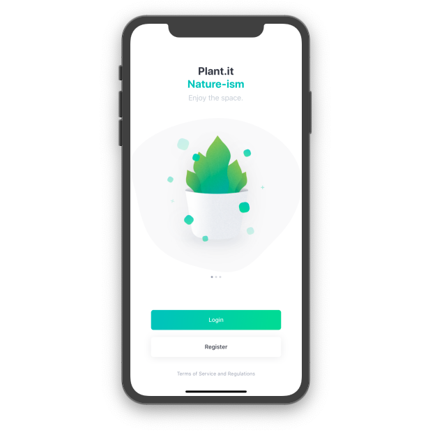

# Plant.it
A plant application, made using React-Native, and [Expo.io](https://expo.io).

This project was made after this UI design from [Dribbble](https://dribbble.com/shots/4569970-Plant-Freebie-2-Dribbble-Invites).

## Project Status

[](https://opensource.org/licenses/Apache-2.0)
[](https://www.npmjs.com/)


## Version

Current app version is on 1.0.
Production level still active.

## Display
Below is the display of the app first time being runned.



## Installation

To run the app for production, follow the instructions below:

```sh
First, you will need Expo to run the app.

After you installed Expo, download/clone the app and install the needed dependencies.

And, after it is done, run the app with the command "yarn start"
```

## Licensed under [Apache-2.0](https://raw.githubusercontent.com/hasimy-as/Plant.it/master/LICENSE)

Happy coding!
~Hasimy
